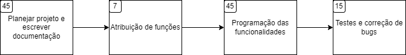
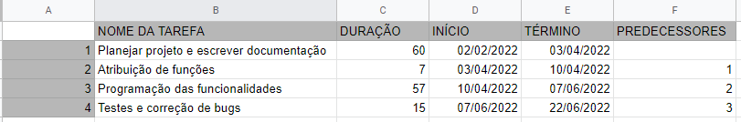
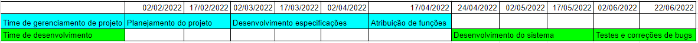
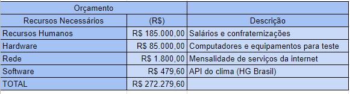

## Especificações do Projeto

Pré-requisitos: <a href="1-Documentação de Contexto.md"> Documentação de Contexto</a>

Definição do problema e ideia de solução a partir da perspectiva do usuário. É composta pela definição do  diagrama de personas, histórias de usuários, requisitos funcionais e não funcionais além das restrições do projeto.

Apresente uma visão geral do que será abordado nesta parte do documento, enumerando as técnicas e/ou ferramentas utilizadas para realizar a especificações do projeto

## Personas

As entrevistas foram feitas e as histórias contadas estão abaixo:

|  | **RAFAEL** ||
|:---:|:---:|:---:|
||||
| **Idade:** | **Ocupação:** | **Aplicativos:** |
| 27 anos | Personal Trainer | Google Agenda; Nike Run Club; Funções de clima nativos |
||||
| **Motivações:** | **Frustrações:** | **Hobbies, História:** |
| Poder ter uma forma fácil de mostrar meus agendamentos, e saber como o dia vai estar. | Sempre que marco um horário com um aluno, fico preocupado de como vai estar o tempo, especificamente se o treino for em um local aberto. | Gosto de trabalhar com pessoas. Ser bem organizado. Treinar ao ar livre. |

|  | **RODRIGO** ||
|:---:|:---:|:---:|
||||
| **Idade:** | **Ocupação:** | **Aplicativos:** |
| 32 anos | Empresário | Linkedin; Twitter; Google Drive |
||||
| **Motivações:** | **Frustrações:** | **Hobbies, História:** |
| Conseguir armazenar suas informações não críticas, em um único lugar, que seja de fácil acesso e seja acessado com poucos cliques | Nos dias mais movimentados em seu cotidiano costuma esquecer documentos ou itens relacionados com reuniões marcadas em sua empresa. | Ser bem organizado. Nunca se atrasar. Ter controle sobre suas informações |

|  | **MICHELE** ||
|:---:|:---:|:---:|
||||
| **Idade:** | **Ocupação:** | **Aplicativos:** |
| 29 anos | Guia Turistica | Pinterest; Instagram; Google Maps |
||||
| **Motivações:** | **Frustrações:** | **Hobbies, História:** |
| Sempre tentar trazer a melhor experiência para os seus clientes em suas viagens. | Quando ela marca algo com um grupo de turistas, ela sempre fica com medo de como vai estar o tempo, porque é sempre bom avisar com antecedência se a viagem terá que ser adiada, pois como são muitas viagens que ela realiza, nunca se lembra de olhar como vai estar o dia. | Ensinar história. Alegrar seus clientes. Viajar.|

## Histórias de Usuários

Com base na análise das personas forma identificadas as seguintes histórias de usuários:

|EU COMO... `PERSONA`| QUERO/PRECISO ... `FUNCIONALIDADE` |PARA ... `MOTIVO/VALOR`                 |
|--------------------|------------------------------------|----------------------------------------|
|Rafael | Saber sobre o clima em dias de treino aberto. | Conseguir cancelar meu horário com antecedência, para poder remarcar com o aluno, sem causar desentendimentos. |
|Rodrigo | Armazenar informações não críticas em um único lugar. | Sempre que preciso relacionar algum documento a uma reunião, queria que esteja tudo relacionado em um app. |
|Michelle | Uma ferramenta que eu possa ver o clima em um agendamento no app, independente da cidade que foi selecionada. | Sempre que eu viajo para ser guia, pode ter um problema, que é o clima, determinados locais, não podem ser aproveitados dependendo do tempo. |
|Rafael | Deixar marcado meu horário com os alunos de forma simples. | Para que seja fácil de gerenciar esse horário, sem muitos cliques. |
|Rodrigo | Organizar horários agendados. | Tenho muitas reuniões durante o dia, e queria organizar melhor esse tempo. |

Apresente aqui as histórias de usuário que são relevantes para o projeto de sua solução. As Histórias de Usuário consistem em uma ferramenta poderosa para a compreensão e elicitação dos requisitos funcionais e não funcionais da sua aplicação. Se possível, agrupe as histórias de usuário por contexto, para facilitar consultas recorrentes à essa parte do documento.

> **Links Úteis**:
> - [Histórias de usuários com exemplos e template](https://www.atlassian.com/br/agile/project-management/user-stories)
> - [Como escrever boas histórias de usuário (User Stories)](https://medium.com/vertice/como-escrever-boas-users-stories-hist%C3%B3rias-de-usu%C3%A1rios-b29c75043fac)
> - [User Stories: requisitos que humanos entendem](https://www.luiztools.com.br/post/user-stories-descricao-de-requisitos-que-humanos-entendem/)
> - [Histórias de Usuários: mais exemplos](https://www.reqview.com/doc/user-stories-example.html)
> - [9 Common User Story Mistakes](https://airfocus.com/blog/user-story-mistakes/)

## Requisitos

As tabelas que se seguem apresentam os requisitos funcionais e não funcionais que detalham o escopo do projeto.

### Requisitos Funcionais

|ID    | Descrição do Requisito  | Prioridade |
|------|-----------------------------------------|----|
|RF-001| A página inicial da aplicação deve possibilitar ao usuário fazer login, se cadastrar ou alterar sua senha; | ALTA | 
|RF-002| A aplicação deve permitir ao usuário adicionar suas anotações. | ALTA |
|RF-003| A aplicação deve permitir visualizar o clima em tempo real. | ALTA |
|RF-004| A aplicação deverá permitir fazer o acompanhamento do local escolhido através de uma API de Geolocalização. | MÉDIA |
|RF-005| A aplicação deve conter um espaço para o usuário adicionar fotos. | MÉDIA |
|RF-006| A aplicação deverá permitir ao usuário visualizar seus compromissos na semana ou mês. | ALTA |
|RF-007| A aplicação deverá ter como itens de menu: Home, agenda, clima, sobre e Contato; | BAIXA |
|RF-008| A aplicação deve permitir ao usuário visualizar a agenda e o clima. | MÉDIA |
|RF-009| A aplicação deve permitir ao usuário de agenda apagar suas anotações ou marcar como finalizadas. | ALTA |

### Requisitos não Funcionais

|ID     | Descrição do Requisito  |Prioridade |
|-------|-------------------------|----|
|RNF-001| UI deve ser compatível com a resolução das telas da maioria dos smartphones | ALTA | 
|RNF-002| O aplicativo deverá respeitar as autorizações e restrições de privacidade do usuário. |  ALTA | 
|RNF-003| O aplicativo deve possuir integração com contas vinculadas de outros serviços. |  MÉDIA | 
|RNF-004| Os serviços de monitoramento de clima serão limitados ao território brasileiro. |  BAIXA | 
|RNF-005| Será implementado um sistema de monetização através de ads. |  MÉDIA | 
|RNF-006| O sistema de ads não deverá prejudicar a experiência do usuário no aplicativo. |  BAIXA | 

Com base nas Histórias de Usuário, enumere os requisitos da sua solução. Classifique esses requisitos em dois grupos:

- [Requisitos Funcionais
 (RF)](https://pt.wikipedia.org/wiki/Requisito_funcional):
 correspondem a uma funcionalidade que deve estar presente na
  plataforma (ex: cadastro de usuário).
- [Requisitos Não Funcionais
  (RNF)](https://pt.wikipedia.org/wiki/Requisito_n%C3%A3o_funcional):
  correspondem a uma característica técnica, seja de usabilidade,
  desempenho, confiabilidade, segurança ou outro (ex: suporte a
  dispositivos iOS e Android).
Lembre-se que cada requisito deve corresponder à uma e somente uma
característica alvo da sua solução. Além disso, certifique-se de que
todos os aspectos capturados nas Histórias de Usuário foram cobertos.

## Restrições

O projeto está restrito pelos itens apresentados na tabela a seguir.

|ID| Restrição                                             |
|--|-------------------------------------------------------|
|01| O projeto deverá ser entregue no final do semestre letivo, não podendo extrapolar a data de 22/06/2022. |
|02| O aplicativo deve manter todas as anotações privadas para cada usuário. Somente o criador de cada anotação tem acesso a ela. |
|03| A aplicação não deve usar nada que não foi previamente apresentado nas disciplinas dos microfundamentos. |

Enumere as restrições à sua solução. Lembre-se de que as restrições geralmente limitam a solução candidata.

> **Links Úteis**:
> - [O que são Requisitos Funcionais e Requisitos Não Funcionais?](https://codificar.com.br/requisitos-funcionais-nao-funcionais/)
> - [O que são requisitos funcionais e requisitos não funcionais?](https://analisederequisitos.com.br/requisitos-funcionais-e-requisitos-nao-funcionais-o-que-sao/)

## Diagrama de Casos de Uso

O diagrama de casos de uso é o próximo passo após a elicitação de requisitos, que utiliza um modelo gráfico e uma tabela com as descrições sucintas dos casos de uso e dos atores. Ele contempla a fronteira do sistema e o detalhamento dos requisitos funcionais com a indicação dos atores, casos de uso e seus relacionamentos. 

As referências abaixo irão auxiliá-lo na geração do artefato “Diagrama de Casos de Uso”.

> **Links Úteis**:
> - [Criando Casos de Uso](https://www.ibm.com/docs/pt-br/elm/6.0?topic=requirements-creating-use-cases)
> - [Como Criar Diagrama de Caso de Uso: Tutorial Passo a Passo](https://gitmind.com/pt/fazer-diagrama-de-caso-uso.html/)
> - [Lucidchart](https://www.lucidchart.com/)
> - [Astah](https://astah.net/)
> - [Diagrams](https://app.diagrams.net/)

# Matriz de Rastreabilidade

A matriz de rastreabilidade é uma ferramenta usada para facilitar a visualização dos relacionamento entre requisitos e outros artefatos ou objetos, permitindo a rastreabilidade entre os requisitos e os objetivos de negócio. 

A matriz deve contemplar todos os elementos relevantes que fazem parte do sistema, conforme a figura meramente ilustrativa apresentada a seguir.

> **Links Úteis**:
> - [Artigo Engenharia de Software 13 - Rastreabilidade](https://www.devmedia.com.br/artigo-engenharia-de-software-13-rastreabilidade/12822/)
> - [Verificação da rastreabilidade de requisitos usando a integração do IBM Rational RequisitePro e do IBM ClearQuest Test Manager](https://developer.ibm.com/br/tutorials/requirementstraceabilityverificationusingrrpandcctm/)
> - [IBM Engineering Lifecycle Optimization – Publishing](https://www.ibm.com/br-pt/products/engineering-lifecycle-optimization/publishing/)

# Gerenciamento de Projeto

De acordo com o PMBoK v6 as dez áreas que constituem os pilares para gerenciar projetos, e que caracterizam a multidisciplinaridade envolvida, são: Integração, Escopo, Cronograma (Tempo), Custos, Qualidade, Recursos, Comunicações, Riscos, Aquisições, Partes Interessadas. Para desenvolver projetos um profissional deve se preocupar em gerenciar todas essas dez áreas. Elas se complementam e se relacionam, de tal forma que não se deve apenas examinar uma área de forma estanque. É preciso considerar, por exemplo, que as áreas de Escopo, Cronograma e Custos estão muito relacionadas. Assim, se eu amplio o escopo de um projeto eu posso afetar seu cronograma e seus custos.

## Gerenciamento de Tempo

Com diagramas bem organizados que permitem gerenciar o tempo nos projetos, o gerente de projetos agenda e coordena tarefas dentro de um projeto para estimar o tempo necessário de conclusão.

O gráfico de Gantt ou diagrama de Gantt também é uma ferramenta visual utilizada para controlar e gerenciar o cronograma de atividades de um projeto. Com ele, é possível listar tudo que precisa ser feito para colocar o projeto em prática, dividir em atividades e estimar o tempo necessário para executá-las.

## Gerenciamento de Equipe

O gerenciamento adequado de tarefas contribuirá para que o projeto alcance altos níveis de produtividade. Por isso, é fundamental que ocorra a gestão de tarefas e de pessoas, de modo que os times envolvidos no projeto possam ser facilmente gerenciados. 

## Gestão de Orçamento

O processo de determinar o orçamento do projeto é uma tarefa que depende, além dos produtos (saídas) dos processos anteriores do gerenciamento de custos, também de produtos oferecidos por outros processos de gerenciamento, como o escopo e o tempo.

